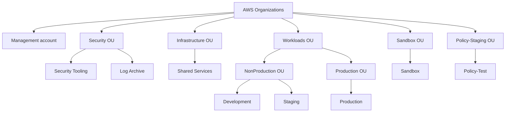

# AWS multi-account landing-zone reconstruction

This repository is a clean-room reconstruction of AWS multi-account
landing-zone patterns previously implemented professionally. It is a public
portfolio artifact: the code demonstrates architecture boundaries, security
judgment, Terraform/Terragrunt composition, testing, and operational failure
thinking without claiming a production deployment or real AWS validation.

## The problem and design goals

A multi-account AWS environment needs more than a list of accounts. It needs
clear ownership boundaries for organization administration, security tooling,
audit-log custody, shared services, workloads, and policy testing. The design
also needs controlled rollout paths for restrictive guardrails and state
boundaries that limit blast radius.

The approved v1 design therefore uses:

- AWS Organizations with a minimally used management account;
- dedicated Security Tooling and Log Archive accounts;
- separate production and non-production workload boundaries;
- staged SCP rollout through Policy-Staging, Sandbox where relevant,
  NonProduction, and Production;
- a multi-Region organization CloudTrail trail with centralized S3/KMS
  storage; and
- Terraform modules plus Terragrunt live composition with separate state
  boundaries.

The primary AWS Region for regional provider configuration is `eu-west-1`.
AWS Organizations itself is global.

## Architecture overview



The management account remains directly under the organization root and is
not represented as a member-account resource or OU child. Account names in
this diagram are functional labels, not account IDs.

## What is implemented in code

Reusable Terraform modules currently cover:

- the AWS Organization and approved OU hierarchy;
- the eight-account account-vending contract;
- five SCP policy definitions and explicit attachment interfaces in
  `modules/scp`;
- CloudTrail trusted access;
- CloudTrail delegated-administrator registration;
- Log Archive S3/KMS storage and CloudTrail delivery policies; and
- the single organization CloudTrail trail definition.

The Terragrunt live composition currently contains the v1 CloudTrail chain:

```text
management/organization
    ├── management/accounts
    │       └── management/cloudtrail-bootstrap
    ├── management/cloudtrail-trusted-access
    │       ├── management/cloudtrail-bootstrap
    │       └── management/cloudtrail
    └── log-archive/cloudtrail-storage
            └── management/cloudtrail
```

The live units are source configuration only. No AWS account, SCP, trusted
access relationship, delegated administrator, bucket, key, trail, or log
delivery has been created by this repository.

## Security and governance decisions

SCPs are deny-oriented governance guardrails, not IAM permission grants. The
five approved policies protect account membership, regional boundaries,
CloudTrail configuration, security-service configuration, and routine member
root-user activity. Attachments remain caller-controlled and must follow the
staged rollout documented in [docs/scp-rollout.md](docs/scp-rollout.md).

Security Tooling is the intended delegated administration boundary for
GuardDuty, Security Hub, and CloudTrail-related security operations where AWS
supports it. Log Archive is a separate audit-custody boundary. IAM Identity
Center is the intended normal human-access model, but its infrastructure is
not implemented in this repository.

## Centralized CloudTrail design

The v1 logging design uses one multi-Region organization trail with:

- `eu-west-1` as the home Region;
- global service events enabled;
- read/write management events;
- log-file validation enabled; and
- no baseline data events, network activity events, Insights, CloudWatch Logs,
  or SNS delivery.

The Log Archive account owns the S3 bucket and customer-managed KMS key.
Security Tooling is the intended delegated administrator, while the
Organizations management account remains the service-level owner and the
initial Terraform execution context for the trail. See
[docs/cloudtrail-logging.md](docs/cloudtrail-logging.md) for ownership,
delivery, and failure details.

## Terraform, Terragrunt, and state boundaries

Terraform modules remain reusable and provider-free. Terragrunt supplies
account/environment composition, generated providers, dependency wiring, and
the live state boundaries. The design separates at least Organization, account
vending, trusted access, delegated administration, Log Archive storage, and
the organization trail. It intentionally avoids one organization-wide state.

Remote state and its backend infrastructure are not implemented. Current local
state is suitable only for static/local development and validation examples;
it is not the production state architecture.

## Validation status

Validation is deliberately separated from AWS deployment claims. Terraform
native tests use provider mocking and verify module contracts. Terragrunt HCL
formatting and selected render/validate paths have been exercised locally with
synthetic inputs and a local AWS provider mirror. Provider initialization and
dependency traversal can still be environment-sensitive, especially when
upstream state is absent.

No AWS credentials are required for the repository's mocked tests, and no
`apply` or `destroy` should be run as part of local validation. The detailed
status matrix is in [docs/validation.md](docs/validation.md).

## Failure and recovery thinking

The repository treats wrong account context, missing dependency state, account
creation failures, bucket-name collisions, KMS policy errors, CloudTrail
delivery failures, broad SCP attachments, Region restrictions, and partial
state operations as explicit operational risks. See
[docs/failure-scenarios.md](docs/failure-scenarios.md) for symptoms, blast
radius, detection, and safe recovery direction.

## Repository structure

```text
modules/       Reusable Terraform modules and native tests
live/          Terragrunt composition and provider-generation context
docs/          Architecture, operational design, validation, and ADRs
```

There is currently no committed GitHub Actions workflow or `scripts/ci/`
implementation. CI orchestration is an approved future repository concern;
local commands remain the source of the validation evidence documented here.

## Deferred scope and limitations

The following are intentionally design-only or deferred:

- remote-state infrastructure and backend naming;
- real provider authentication, account identity verification, and role
  assumption;
- AWS account creation and account readiness validation;
- SCP attachment and enforcement validation in AWS;
- trusted-access and delegated-administrator behavior in AWS;
- S3/KMS/CloudTrail delivery validation and object-arrival evidence;
- GuardDuty, Security Hub, IAM Identity Center, networking, Transit Gateway,
  workload VPCs, budgets, and AWS Config resources;
- multi-Region workload architecture, Control Tower, IPAM, Network Firewall,
  Kubernetes, application workloads, SIEM platforms, and Service Catalog.

These omissions are scope boundaries, not claims that the capabilities are
unnecessary in every future environment.

## Local inspection

From the repository root, inspect formatting with:

```text
terraform fmt -check -recursive
terragrunt hcl fmt --check
git diff --check
```

For a module, use its established local provider strategy when needed:

```text
terraform init -backend=false
terraform validate
terraform test
```

For live composition, provide only synthetic validation values, use
`terragrunt render` or `terragrunt validate`, and never allow dependency mocks
to reach `apply` or `destroy`.

## License

Apache-2.0. The license text is included in [LICENSE](LICENSE).
