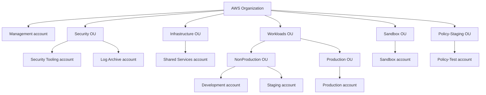
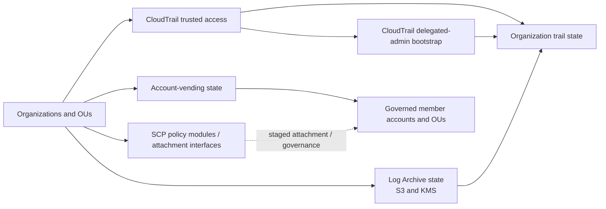

# AWS multi-account landing-zone architecture

## Purpose

This repository documents a clean-room reconstruction of an AWS multi-account
landing-zone architecture. The architecture makes account boundaries, security
responsibilities, network isolation, and infrastructure composition explicit
before and alongside implementation.

The primary AWS region is `eu-west-1`. AWS Organizations provides the account
and organizational-unit hierarchy. The Organizations management account is
kept minimal, while security operations, centralized logging, identity, and
workload concerns are assigned to dedicated boundaries.

## Organization hierarchy

Member accounts are initially intended to be created by Terraform as part of
account-vending functionality. The account hierarchy is an architectural
boundary; it does not by itself imply that every account has been created or
that the architecture has been deployed or validated against AWS.

## Control and composition relationships

The following relationships describe the implemented Terraform/Terragrunt
boundaries and intended AWS control flow. They do not represent deployed
resources or successful AWS integration.

SCP definitions and caller-controlled attachment interfaces are implemented,
along with rollout documentation and tests. SCPs govern principals in
attached member accounts and OUs; they do not apply to Terraform state, grant
permissions, or constrain principals in the Organizations management account.
No SCP live Terragrunt/state unit or real AWS attachment/enforcement is
implemented. Terragrunt uses separate state boundaries for the implemented
Organization/OUs, account-vending, trusted-access, delegated-administration,
Log Archive storage, and organization-trail units. SCP definitions and
attachment interfaces are not represented by a live Terragrunt/state unit.
Terragrunt expresses output dependencies separately from ordering-only
dependencies.

## Implementation status

Implemented in repository code:

- Organization and approved OU Terraform module;
- member-account vending Terraform module;
- five SCP policy definitions with caller-controlled attachment maps;
- CloudTrail trusted-access, delegated-admin, Log Archive storage, and
  organization-trail Terraform modules; and
- Terragrunt live units for the v1 centralized CloudTrail composition chain.

Design-only or not validated against real AWS:

- account creation, account readiness, and cross-account authentication;
- SCP attachment enforcement and staged promotion;
- trusted access and delegated-administrator behavior;
- S3/KMS/CloudTrail delivery and object-arrival evidence;
- Security Hub, GuardDuty, IAM Identity Center, networking, and workload
  infrastructure resources;
- remote-state infrastructure and backend configuration; and
- CI workflows and the `scripts/ci/` implementation layer.

## Account-category responsibilities

- **Management account:** Organizations-level functions that require the
  management account, including organization administration and account
  governance. Routine security operations and workloads do not belong here.
- **Security OU:** Houses dedicated security administration and centralized
  logging accounts so those responsibilities remain separate from workloads.
- **Infrastructure OU:** Houses shared platform services that are intentionally
  common to multiple accounts. It is not a location for production workloads,
  centralized security administration, or the log archive.
- **Workloads OU:** Contains workload accounts with separate organizational
  boundaries for non-production and production. Workload placement and
  connectivity must respect those boundaries.
- **Sandbox OU:** Provides an isolated account for experimentation and
  evaluation. It is not a substitute for production, staging, centralized
  security, or centralized logging boundaries.
- **Policy-Staging OU:** Provides a controlled account boundary for staged SCP
  validation before broader organizational attachment. It is not a general
  application-workload or production boundary.

Security Hub uses delegated administration with central configuration, with
AWS Foundational Security Best Practices as the initial standard. GuardDuty
also uses delegated administration. Audit logging is centralized in the Log
Archive account through the approved v1 design of one multi-Region
organization trail with `eu-west-1` as its home Region; the detailed
CloudTrail and storage design is documented in `docs/cloudtrail-logging.md`.
IAM Identity Center is the normal human-access model.

Transit Gateway provides the hub-and-spoke network pattern. Workload VPCs use
production-style public/private subnet topology. Connectivity between
production and non-production is not implicitly open; any permitted path must
be intentional and governed by the relevant network and security design.

Terraform provides reusable, environment-agnostic infrastructure modules.
Terragrunt composes account and environment stacks and their dependencies.
Terraform state is divided across meaningful architectural domains and account
boundaries rather than held in one organization-wide state. GitHub Actions is
the approved future CI orchestrator, with substantive CI logic intended to
live under `scripts/ci/`; no workflow is currently committed. The repository
is licensed under Apache-2.0.

## Deliberately deferred from v1

The following concerns are intentionally outside this v1 architecture:

- AWS Control Tower;
- multi-region workload architecture;
- AWS IPAM;
- AWS Network Firewall;
- Kubernetes and application workloads;
- SIEM platforms; and
- AWS Service Catalog.

Deferring these concerns keeps the documented architecture focused on account
structure, delegated security, centralized logging, identity, network
boundaries, and infrastructure composition. Their absence is not a claim that
they are unnecessary in every future design.

## Documentation status

This document records approved architectural intent. It does not claim a
production deployment, successful AWS validation, test execution, or any
operational outcome.
